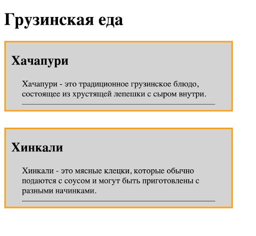

# Задачи (Каждая задача - отдельный html документ)
* ## Задача А
  ### Создание стилизованной веб-страницы о редких природных явлениях
```html
<!DOCTYPE html>
<html>
<head>
    <title>Редкие природные явления</title>
    <link rel="stylesheet" type="text/css" href="styles.css">
</head>
<body>
    <header>
        <h1>Редкие природные явления</h1>
    </header>
    <nav>
        <ul>
            <li><a href="#">Северное сияние</a></li>
            <li><a href="#">Подводные гейзеры</a></li>
        </ul>
    </nav>
    <main>
        <section class="phenomenon">
            <h2>Северное сияние</h2>
            <p class="phenomenon-description">Северное сияние — это невероятное небесное явление, которое можно увидеть в высоких широтах Севера. Оно создает впечатляющие световые шоу в ночном небе.</p>
            <span class="phenomenon-highlight">Особенность:</span>
            <p>Северное сияние иногда называют "полярными сияниями" и оно бывает разных цветов: зеленое, розовое, фиолетовое и даже красное!</p>
        </section>
        <section class="phenomenon">
            <h2>Подводные гейзеры</h2>
            <p class="phenomenon-description">Подводные гейзеры - это потрясающее природное явление, когда гейзеры выбрасывают воду и пар из океанских глубин.</p>
            <span class="phenomenon-highlight">Уникальность:</span>
            <p>Подводные гейзеры часто сопровождаются образованием дыма и бурым мутным облаком, что создает впечатление подводного вулкана.</p>
        </section>
    </main>
</body>
</html>
```
Задание:
1. Создайте файл стилей `styles.css`.
2. В файле стилей `styles.css`:
   * Стилизуйте элемент `<header>`: `background-color: gray;` `color: white;` `text-align: center;` `padding: 10px;`.
   * Стилизуйте элемент `<nav>` так, чтобы ссылки (элементы `<a>`) были синего цвета, без подчеркивания.
      `color: blue;` `text-decoration: none;`
   * С помощью вложенных селекторов, стилизуйте заголовки `<h2>` внутри элементов с классом `.phenomenon` так, чтобы они были синего цвета.
      `color: blue;`
   * С помощью вложенных селекторов, стилизуйте элементы `<p>` внутри элементов с классом `.phenomenon-description` так, чтобы они имели отступ слева 20 пикселей и цвет текста был серым.
      `margin-left: 20px;` `color: gray;`
   * С помощью вложенных селекторов, стилизуйте элементы `<span>` с классом `.phenomenon-highlight` внутри элементов с классом `.phenomenon` так, чтобы они были желтого цвета и текст был выделен жирным шрифтом.
     `color: yellow;` `font-weight: bold;`
3.  Сохраните файл стилей и откройте HTML-документ в веб-браузере. Убедитесь, что стили были успешно переопределены в соответствии с заданием.


* ## Задача В
  ### Изменение страницы "О себе" в визитку
Вам предстоит внести изменения в страницу "О себе", чтобы сделать ее визитной карточкой. Вы будете использовать знания о CSS, чтобы стилизовать страницу и сделать ее более привлекательной.
Инструкции:
* Откройте ваш HTML-файл страницы "О себе", который вы ранее создали.
* Используя атрибут `class`, создайте блоки для различных данных визитки, такие как контактная информация, описание, и т.д. Пример:
```html
<div class="contact-info">
   <p>Email: example@example.com</p>
   <p>Телефон: +1234567890</p>
</div>
<div class="description">
   <p>Я увлекаюсь веб-разработкой и люблю создавать красивые веб-страницы.</p>
</div>
```
* В вашем CSS-файле добавьте стили для созданных классов (например, `.contact-info` и `.description`). Вы можете настроить цвет текста, отступы и фон в соответствии с вашим вкусом или использовать заготовку.
```css
  .contact-info {
       padding: 16px;
       color: #333;
   }

   .description {
       padding: 14px;
       border: 3px solid red;
       color: #666;
       margin-top: 10px;
   }
```
* Обновите страницу в браузере и убедитесь, что визитка выглядит как вам нравится.

* ## Задача С
  ###  Создание веб-страницы о грузинской еде (настройка блочной модели)
    * Исходный код:
```html
<!DOCTYPE html>
<html>
<head>
    <title>Грузинская еда</title>
    <link rel="stylesheet" type="text/css" href="styles.css">
</head>
<body>
<h1>Грузинская еда</h1>
    <div class="food-block">
        <h2>Хачапури</h2>
        <p>Хачапури - это традиционное грузинское блюдо, состоящее из хрустящей лепешки с сыром внутри.</p>
    </div>
    <div class="food-block">
        <h2>Хинкали</h2>
        <p>Хинкали - это мясные клецки, которые обычно подаются с соусом и могут быть приготовлены с разными начинками.</p>
    </div>
</body>
</html>
```
Задание:
1. Создайте файл стилей `styles.css`.
2. В файле стилей `styles.css`:
   * Для класса `.food-block`:
     - Задайте фоновый цвет background-color: lightgray; .
     - Установите отступы внутри блока: 10 пикселей сверху и снизу, 20 пикселей слева и справа.
     - Установите толщину бордера в 3 пикселя, стиль - сплошная линия (solid), цвет - orange.

   * Для класса `.food-block` заголовку внутри блока:
     - Установите внешний отступ сверху и снизу в 10 пикселей.

   * Для класса `.food-block` абзацу текста внутри блока:
     - Установите внутренний отступ сверху и снизу в 10 пикселей.
     - Установите внешний отступ слева и справа в 20 пикселей.
     - Установите нижний бордер 1 пиксель, сплошной, черный

3. Сохраните файл стилей и откройте HTML-документ в веб-браузере. Убедитесь, что стили были успешно применены, и каждый блок о грузинской еде имеет заданный визуальный вид.

   


